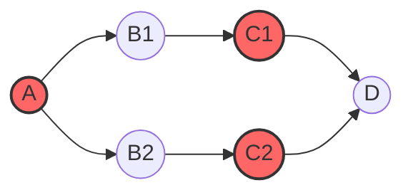

# 1. Git Rebase

> 한 브랜치의 변경 사항을 다른 브랜치 위에 재적용.
>
> git merge와는 다르게 git rebase는 커밋 히스토리를 다시 작성하여 마치 브랜치가 같은 선상에서 작업된 것 처럼 보이게 만듦.

# 2. Git Cherry-Pick

> 특정 커밋을 선택하여, 그 커밋의 변경 사항만을 현재 브랜치에 적용하는 명령. 이를 통해 특정 브랜치의 전체 변경 사항을 병합하지 않고, 필요한 커밋만 골라 적용함

# 3. 3-Way Merge / Cherry-Pick

두 개의 브랜치를 merge / cherry-pick 할 때, 공통 조상 커밋을 기준으로 서로의 변경사항을 merge / cherry-pick 함.

"3-way"란

- Base (공통 조상): 두 브랜치가 동일했던 마지막 커밋. (즉, A)
- Head (현재 브랜치): 현재 브랜치의 최신 커밋.
- Merge branch(병합 대상 브랜치): 병합할 브랜치의 최신커밋

